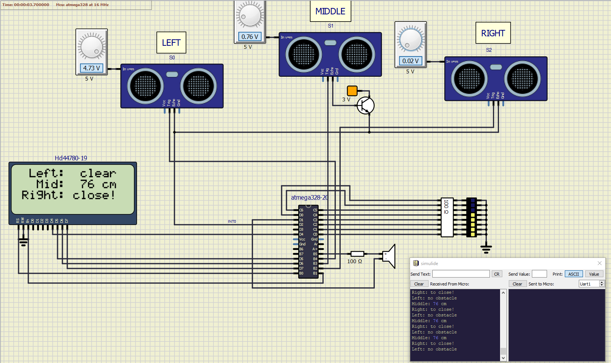

# Range meter - Parking assistant

### Team members

Name: Lukáš Kaleta

ID: xkalet07

[Link to my GitHub project folder](https://github.com/xkalet07/Digital-electronics-2/tree/master/Labs/project)

### Project objectives

Create an parking assistant aplication using several ultrasonic sensors HC-SR04. Implement LCD display showing distance of obstacles in cm, acoustic signaling with different frequencies according to distance, distance indication on LED bar and sending information from the application to the UART.

## Hardware description

Purpose of aplication is to work as a rear parking sensor assistant. Design contains 3 sensors HC-SR04 intended for measuring distance of obstacles in 3 ways at the rear side of a car (Middle, left and right). Distance is shown on 4 line LCD display in cm. Sound signalization is beeping inhas 4 levels dependent on the closest of dictances. LED bar is also implemented and shows 9 levels logarytmicaly dependent on the distance of the middle sensor.

## Code description

Main code can be found in the submited [reopsitory](https://github.com/xkalet07/Digital-electronics-2/tree/master/Labs/project). Here is a short description:

Timer/counter1 is used for switching to one of the 3 sensors every 262 ms and sending an 10us trigger pulse from corresponding pin to the trigger pin of current sensor. The three echo pins of sensors shares one interrupt pin INT0 of MCU. INT0 runs interrupt sequence function that uses an while loop to measure the lenght of the echo pulse. Then the distance is calculated and written to both LCD and UART for corresponding sensor. Two more special states of distance are added. These are the "To close to the sensor!" state triggered when the minnimum range of HC-SR04 is surpassed and "No obstacle in the way", which means that the obstacle is out of sensors range.

Timer/counter2 is used for generating the sound frequency by toggling the sound output PB5 pin 1 and 0. When the distance of all three sensors is more than 200 cm PB5 isn't toggled and no sound is generated. Under 200 cm the sound is generated and frequency is changing by setting timer/counter2 owerflow to: 
* 2 ms when lowest distance < or = 200 cm
* 1 ms when lowest distance < or = 70 cm
* 512 us for lowest distance < or = 30 cm

Sound is also switchong between enabled and disabled every time Timer/counter1 owerflows, which changes continuous sound to beeping.

LED bar is conected in parallel to PC port and PD0 pin of the MCU. All LEDs of the LED bar are defaultly turned off when distance of the rear middle sensor is out of 400cm range. But when the distance gets lower than 400 cm first LED is lit. Then one more of eight LEDs is lit by surpasing 300, 225, 160, 110, 70, 40 and 15 cm with decreasing distance. For distance lower than 15 cm is all LED bar lit.

## Animation of SimulIDE

Animation shows working Range meter measuring distance with all 3 sensors siulated in SimulIDE. Minimal and maximal HC-SR04 range are also shown.

## References

1. Tomáš Frýza, **Digital electronics 2 - GitHub repository**: [https://github.com/tomas-fryza/Digital-electronics-2](https://github.com/tomas-fryza/Digital-electronics-2)
2. Peter Fleury, **AVR-GCC libraries**: [http://www.peterfleury.epizy.com/avr-software.html](http://www.peterfleury.epizy.com/avr-software.html)
3. Elec Freaks, **Ultrasonic Ranging Module HC - SR04 **: [https://cdn.sparkfun.com/datasheets/Sensors/Proximity/HCSR04.pdf](https://cdn.sparkfun.com/datasheets/Sensors/Proximity/HCSR04.pdf)
